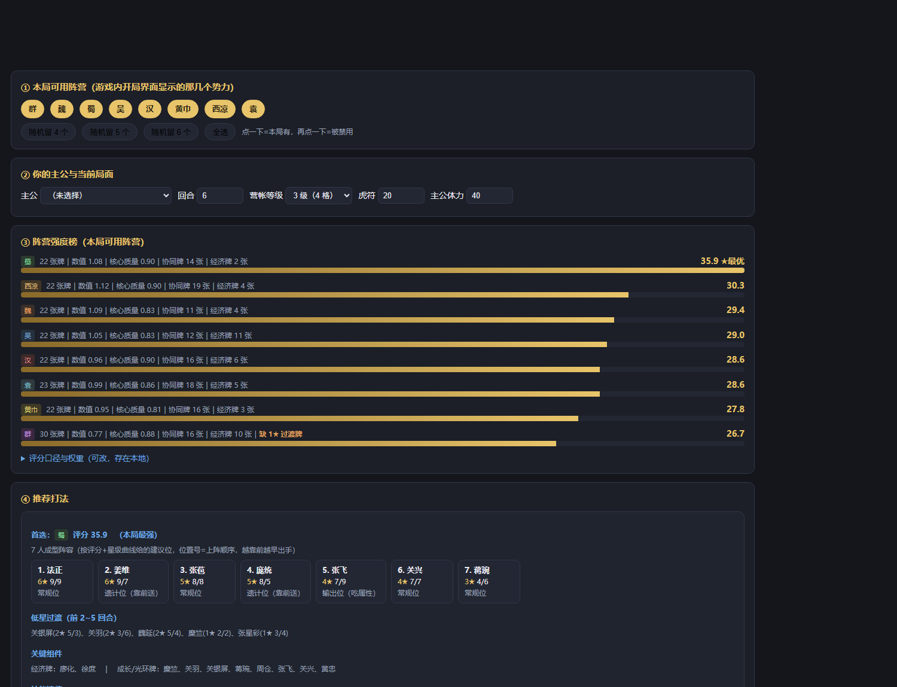
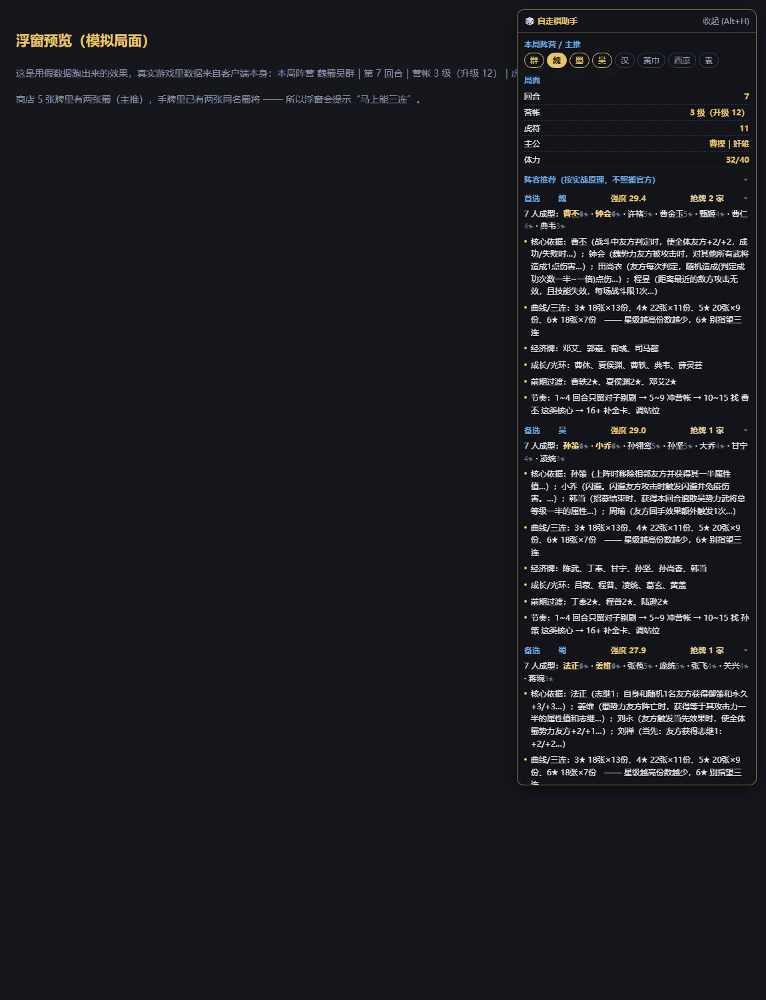
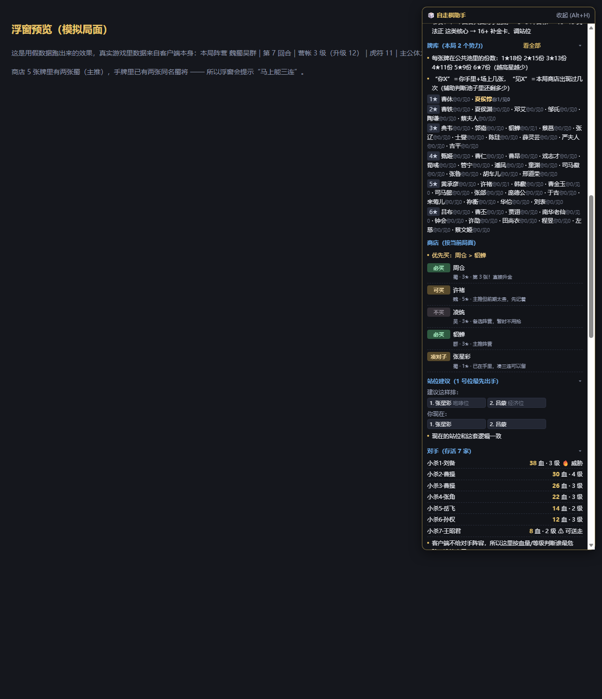
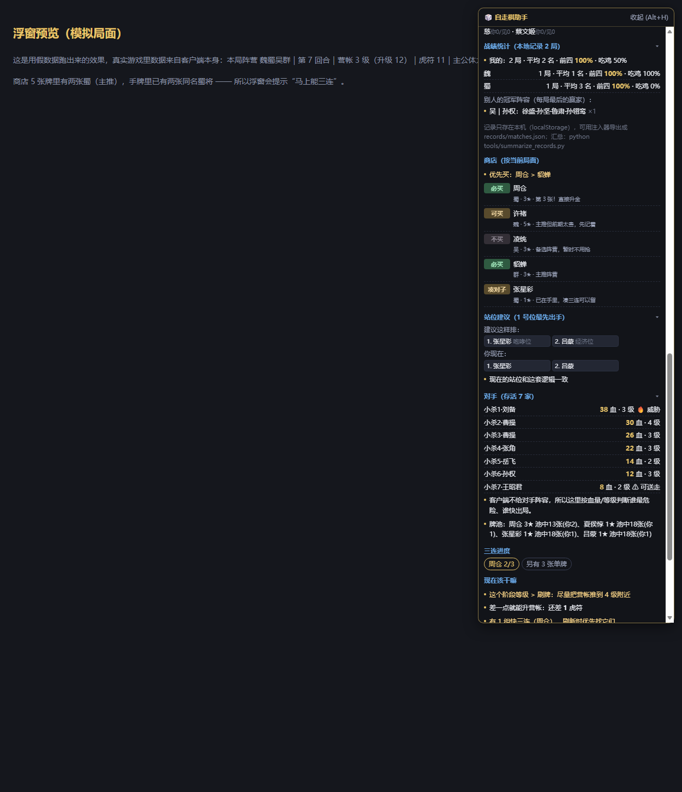

# 三国杀自走棋辅助脚本

给《三国杀·一将成名》自走棋（酒馆战棋）写的辅助工具：**数据全部从游戏客户端配置里解出来，不抄攻略**。

两种用法，随你挑：

| 用法 | 入口 | 特点 |
|---|---|---|
| 网页版（离线查询 / 决策） | 双击 `index.html` | 不进游戏、不注入，纯离线查棋子/算阵营/看运营节奏 |
| 游戏内浮窗（实时） | 双击 `启动并注入.bat` | 像小抄一样贴在游戏右上角：读局面、给买牌/站位/选牌建议，并自动记录对局 |

> 浮窗**只读**：不发送游戏协议、不自动操作、不改数据。

## 功能一览

- **真实数据**：解密官方 `Config.sgs`，拿到棋子/主公/锦囊/装备/营帐概率/经济参数/公共牌池份数。
- **牌库**：本局可用势力每张棋子的池中份数（1★18 / 2★15 / 3★13 / 4★11 / 5★9 / 6★7）、你持有几张、本局商店出现过几次。
- **阵容推荐（2~3 套，跨阵营拼牌）**：每套给完整的 7 人成型阵容 + **跨阵营插件**（放大器 / 触发桥 / 万能牌）+ **主公推荐** + 节奏 + 弱点；
  每套还会按你手上的牌算"已有几成"，并叠加你本地记录的吃鸡数据；
- **阵容克制关系**：推荐的几套之间互相打是优/劣/五五，附一句原因（本局八家抢同一池子，这决定你最后选谁）；
- **站位建议**：按技能触发时机给 1~7 号位排序，并直接给出"把谁挪到几号位"。
- **选牌建议**：商店每张牌 `必买/可买/凑对子/攒钱买/不买`；三选一（锦囊/武将/装备）给 `选这个/次选/不选`。
- **对手面板**：八家血量/等级/主公/装备，🔥威胁与 ⚠可送走。
- **对局记录 + 战绩统计**：自动记录自己的每局（含每回合虎符曲线、最终阵容、名次），并从战斗期抓取对手阵容，汇总出"我的各势力胜率"和"别人的冠军阵容"。

## 快速开始

```bat
:: 1) 更新数据（新赛季/平衡性调整后重跑；首次需 python -m pip install wasmtime）
更新数据.bat

:: 2) 装一次"自动注入"（后台监视 + 开机自启），之后随便怎么开游戏都会自动挂上浮窗
安装自动启动.bat

:: 2b) 只想这次用一下：手动启动并注入（会提示是否需要重启客户端）
启动并注入.bat

:: 3) 打完几局后汇总自己的战绩
python tools/summarize_records.py
```

装过 `安装自动启动.bat` 之后，**你从 Steam 点开始游戏、桌面图标、甚至 Steam 的"最近游玩"都能自动注入**，不用再管；
不想用了双击 `卸载自动启动.bat`。日志在 `logs/auto-watch.log`。

只想离线看数据：直接双击 `index.html`。

## 界面预览

（下面全部是用假局面渲染的演示图，不含任何玩家信息）

| 网页版 | 浮窗 · 阵容与原理 |
|---|---|
|  |  |

| 浮窗 · 牌库 | 浮窗 · 战绩统计 |
|---|---|
|  |  |

## 文档

- [docs/使用手册.md](docs/使用手册.md) —— 每个面板区块什么意思、快捷键、常见问题
- [docs/技术说明.md](docs/技术说明.md) —— 配置解密、状态读取路径、官方接口签名、记录器实现
- [docs/更新日志.md](docs/更新日志.md) —— 每一次"发现什么问题 → 原因 → 怎么修的"

---

## 1. 它能回答什么

| 你的问题 | 工具里对应的地方 |
| --- | --- |
| 这局随到这几个阵营，哪个最强？ | 「本局决策 → 阵营强度榜」，按分数排序并给出分项依据 |
| 该选谁当主公？ | 「本局决策 → 主公」，40 位主公的体力/技能原文都在里面 |
| 定什么阵？ | 「推荐打法」里给出 7 人成型阵容（含星级、攻/体、定位、出手顺序） |
| 什么时候升营帐、什么时候刷牌？ | 「运营节奏」按当前回合/等级/虎符给建议；「运营 / 经济」页有完整概率表 |
| 怎么保前四 / 怎么吃鸡？ | 「目标：保前四 / 争第一」两种打法的取舍 |
| 某个武将到底几星、什么技能？ | 「棋子图鉴」185 张当前赛季商店牌，可搜技能关键字 |

---

## 2. 数据来源：不是抄攻略，是从客户端配置里抠的

Steam 版《三国杀》和网页版《三国杀·一将成名》是同一个网页内核（CEF 套壳），游戏资源都在 `web.sanguosha.com` 上。

1. 官方资源站上有整份配置包 `https://web.sanguosha.com/10/pc/res/config/Config.sgs`，以及网页端用来解密它的 WebAssembly 模块 `https://web.sanguosha.com/10/pc/libs/min/resc`；
2. 配置包里的 `.sgs` 文件是 OFB 流密码加密的，客户端靠 `CtrUtil.Ctr.Ofb_Dec` 调 wasm 解密；
3. `tools/update_data.py` 在本地把同一个 wasm 跑起来，对下载到的 `.sgs` 做同样的一次解密，就拿到明文；
4. 从配置包里取出 `TavernChessConfig.sgs`（酒馆自走棋配置），解析出：
   - `ChessConf` → 棋子（势力、星级、攻击、体力、技能、金色版本数值）
   - `ChessGeneralConf` + `ChessGeneralSkillConf` → 主公与主公技能
   - `ChessShopConf` → 营帐等级、升级费用、格子数、各星级刷新权重
   - `ChessGlobalConf` → 虎符收入/利息/刷新价/售价/装备回合/阵亡结算上限
   - `ChessModeSeasonConf` → 赛季与阵营池

解密思路参考了开源项目 [caoyang-sufe/sgs_forward_looking](https://github.com/caoyang-sufe/sgs_forward_looking)（他同时也维护 [sgscodex](https://github.com/caoyang-sufe/sgscodex) 自走棋小抄），在此致谢。本仓库的脚本是独立实现，只做只读解析。

> 也就是说：**棋子数值、技能描述、概率表、主公技能都是当前版本的原样数据**，新赛季更新后重跑一次脚本即可刷新，不需要等我改。

---

## 3. 用法

### 3.1 日常使用

1. 打开游戏，进自走棋，进入选主公界面。这时界面上会列出**本局阵营**（服务器随机分配的那几个势力，其他势力的棋子这一局不会出现在商店里）。
2. 双击 `index.html`，在「本局可用阵营」里点亮这几个势力（点一下=可用，再点一下=当作被禁用）。
3. 选主公、填当前回合 / 营帐等级 / 虎符，下面的榜单和打法会实时更新。

### 3.2 新赛季 / 平衡性调整后更新数据

```bash
python -m pip install wasmtime      # 只装一次
python tools/update_data.py         # 自动联网抓最新配置，重写 data/tavernchess.js
```

抓取失败时，可以自己用浏览器另存 `https://web.sanguosha.com/10/pc/res/config/Config.sgs`，然后：

```bash
python tools/update_data.py --config 路径/Config.sgs
```

---

## 4. 关于「每局随机禁用阵营」

客户端配置里**没有**写死“禁 2 个”，而是服务端在开局时下发本局阵营列表：

```
repeated gameconf.ChessMinionTyp chessMinionTypList = 4;  // 本局阵营
```

新手/人机自定义的默认值是 **4 个阵营可用**（`ChessRookieGameCustomConf`: `MinionNum=4`，魏蜀吴群可用，西凉/袁/黄巾/汉锁定），段位越高解锁越多。所以你直接以游戏里实际显示的几个势力为准，在工具里点出来就行——不管是 4 个、6 个还是全开，排名和推荐都会只在这些阵营里算。

---

## 5. 当前赛季（S11 昭君出塞）要点

从配置里能直接读到的：

- 赛季池 8 个势力：魏、蜀、吴、群、黄巾、汉、西凉、袁（另有神将，只在 6 级商店以 4‰ 权重出现）。
- 势力牌量：魏/蜀/吴/黄巾/汉/西凉 各 22 张，袁 23 张，群 30 张（**群没有 1★ 过渡牌**，起手会比较别扭）。
- 星级分布基本是 `2 / 3 / 4 / 5 / 4`（1★~6★），也就是每个势力低星少、高星多，前期只能靠对子撑。
- 营帐升级标价 6 / 12 / 18 / 20 / 22（每回合 -2，最低 0），格数 3 / 4 / 4 / 5 / 5 / 6，**6 级才有 6★ 和神将**，5 级是 4~5★ 的主力档。
- 装备在第 3 / 7 / 11 回合发放（坐骑 / 武器 / 防具）。
- 阵亡结算上限：剩 6 人时单次最多 10 点，剩 4 人时最多 15 点。

工具默认的评分是「数值 + 核心质量 + 协同 + 经济」四项加权（就是界面上那四个权重），另外留了一个「版本调整」输入，用来表达配置表里看不到、只写在更新公告里的强弱变化。**S11 默认只给蜀 +8**（这赛季官方把蜀整条线重做成了「志继」体系：关羽、关兴、张苞、张飞、黄忠、法正、姜维、刘禅、诸葛亮全部改动，还新增蒋琬、移除秦宓）。

你可以把这几个数字改成自己的手感——工具给的是可解释的排序，不是标准答案。

---

## 6. 运营框架（工具里也会按你的局面自动给）

- **1~4 回合**：别刷。留对子、留虎符，只为了确定本局主线阵营。
- **5~9 回合**：冲营帐等级。这个阶段等级带来的牌池质量 > 刷新收益。
- **10~15 回合**：在 4~5 级牌池找核心，先做出第一个金色稳住战力；观察同桌谁在抢你的牌。
- **16 回合后**：补强 + 调站位。血量健康就存钱等关键牌，血量危险就立刻刷新换即时战力。
- 通用原则：招募阶段加的属性是永久的，战斗阶段的属性会消失 → 优先投资“永久成长/光环”卡；三连的额外三选一价值很高，主力阵营的牌别随手遣散。

---

## 7. 游戏内浮窗版（注入式，可选）

除了网页版，这里还有一个**贴在游戏里的浮窗助手**，工作方式和你给的那份「小抄」同类：客户端是 Chromium（CEF）套壳，用 `--remote-debugging-port=9222` 启动它，就能通过 CDP 把脚本注入进游戏页面。

```bat
启动并注入.bat        :: 找到客户端 → 带调试端口启动 → 自动注入 → 常驻监视（换页/刷新自动重注入）
```

注入后游戏右上角会出现「🎲 自走棋助手」：

- **本局阵营 / 主推**：读 `chessMinionTypList`，标出本局有哪些势力、哪个是本局最强主线；
- **局面**：回合、营帐等级（含当前升级费用，已算上主公技能折扣）、虎符、主公体力；
- **商店（按当前局面）**：每一张牌给 `必买 / 可买 / 凑对子 / 攒钱买 / 不买`，并说明理由（主推阵营、第 3 张直接升金、备选阵营先不抢……）；
- **选主公建议**（选主公阶段）：从本局阵营可用的主公里挑出最省事的几个（经济/成长型优先），并标出势力限制不匹配的；
- **选牌建议**（三选一）：营帐升级的锦囊、三连的武将、第 3/7/11 回合的装备，只要游戏弹出候选，浮窗就会排好「选这个 / 次选 / 不选」并给理由（主推阵营、能直接凑三连、高星核心……）；
- **站位建议**：按技能触发时机给出 1~7 号位的建议顺序（开战/当先、遗计、咆哮、光环、常规、功能、经济），并直接告诉你「把谁从几号位挪到几号位」；
- **对手面板**：8 家的血量、营帐等级、主公、装备数，标出 🔥威胁（血最多的）和 ⚠可送走（快出局的），以及本轮对手是谁；
- **阵容推荐（按实战原理，不照搬官方）**：为每个本局可用势力生成一套 7 人成型阵容（6★×2 + 5★×2 + 4★×2 + 3★×1，缺则顺延），并逐条讲原理：
  *核心依据*（为什么是这几张，直接引用技能原文摘要）、*曲线与三连*（本局该势力各星级有几张牌、每张在池里几份）、
  *经济牌 / 成长光环牌 / 前期过渡牌*、*节奏*（1~4 留对子别刷 → 5~9 冲营帐 → 10~15 找核心 → 16+ 补金卡调站位）；
- **牌库（本局）**：按星级列出本局可用势力的每一张棋子，标注 **池中每张份数**、**你已持有几张**、**本局商店出现过几次**；
  小标题右侧可切换「只看主线 / 看全部势力」。份数是配置表原文：1★18 / 2★15 / 3★13 / 4★11 / 5★9 / 6★7；
- **三连进度**：手牌+场上每张牌 几/3，配上面牌库的份数一起判断这张牌值不值得追；
- **按场上其他主公反向调整**：客户端虽然不给对手阵容，但每家的**主公**是公开的。工具会用「主公的势力限制 + 主公技能里提到的势力」推测各家的流派，
  算出「魏 2 家、蜀 1 家…」这样的抢牌压力，再据此给出「继续抢主线」或「改投更冷门的势力」的建议。
- **现在该干嘛**：按回合与虎符给出「别刷 / 冲营帐 / 找核心 / 保血量」等提示。

拖动标题栏可移动，`Alt+H` 隐藏/显示，标题栏右侧「收起」折叠整个面板；每个区块的小标题（如「对手」「站位建议」）点一下可以单独折叠。

> 说明：游戏客户端**不会**把对手的阵容下发给你（只能看到血量/等级/主公/装备），所以「谁在抢你的牌」做不到逐张点名——浮窗给的是牌池份数 + 对手血量威胁 + 本轮对手信息。

- 在自走棋**大厅/房间**里浮窗会显示一张待机卡片（证明助手活着）；进入对局、到选主公界面后自动切换成完整面板。
- 改了 `overlay.js` 想立刻看到效果，不用重启客户端：`node game_overlay/push.mjs`（热更新，自动顶掉旧面板）。
- 想在浏览器控制台调试读到的原始数据：注入后看 `window.__zzqState`（局面）和 `window.__zzqAnalysis`（判定结果）。

想先看效果又不想开游戏：直接打开 `game_overlay/demo.html`，那是用**假局面**渲染的同款浮窗。

它读的是游戏自己的客户端对象（`scene.manager` 下的 `ShopGoods / HandChess / LineUpChess / ChessMinionTypList / CoinNum / ShopCurLevel / ShopLevelUpCost / CurRound`），**只读**：不发送协议、不买牌、不刷新、不改数据。

原理与实现：

| 文件 | 作用 |
| --- | --- |
| `game_overlay/launch.ps1` | 找客户端、带调试端口启动、CDP 注入、断线重连（`启动并注入.bat` 是它的外壳） |
| `game_overlay/inject.mjs` | 同上的 Node 版本（装了 Node 也能直接用） |
| `game_overlay/overlay.js` | 浮窗本体：场景定位、状态读取、买卖判定、面板渲染 |
| `game_overlay/demo.html` + `mock.js` | 假局面预览页，用于无游戏环境下看效果/调样式 |
| `game_overlay/engine.js` | 阵容引擎：机制标签 → 阵容原型 → 跨阵营插件 → 2~3 套阵容 + 克制矩阵 |
| `tools/test_engine.mjs` | 离线跑引擎、检查阵容质量（`node tools/test_engine.mjs 1,2,3,4`） |
| `tools/summarize_records.py` | 把本地对局记录汇总成你自己的战绩 + 别人的冠军阵容 → `data/stats.js` |

几点说明：

- 注入需要**重启客户端**（已经运行的游戏没法中途加调试端口）；脚本会提示你是否关掉重开。
- Steam 必须先登录，否则客户端起不来。
- 这是第三方注入行为，属于游戏规则灰区，用不用、用多少由你自己判断；本工具只做“看图说话”，不代替你操作。
- 面板数据依赖游戏内部对象名，官方大版本重构（比如换引擎/改类名）有可能失效；失效时改 `overlay.js` 里的 `readState()` 即可，数据与评分部分是独立的。

---

## 8. 文件结构

```
三国杀自走棋助手/
├─ index.html                 # 网页版主程序，双击即用
├─ data/tavernchess.js        # 自动生成的数据（势力/棋子/主公/经济/概率）
├─ tools/update_data.py       # 抓取+解密+转换脚本
├─ tools/.cache/              # 下载缓存（Config.sgs、解密出的配置）
├─ 更新数据.bat                # 一键更新赛季数据
├─ 启动并注入.bat              # 一键启动游戏并注入浮窗
└─ game_overlay/              # 游戏内浮窗（overlay.js / launch.ps1 / inject.mjs / demo.html）
```

---

## 9. 免责与边界

- 网页版（`index.html`）是**离线查阅 + 决策参考**，不进游戏、不发数据包。
- `game_overlay/` 里的浮窗是注入式工具（读游戏内部对象并绘制浮窗），仍然**不做任何自动操作**；相关风险与是否使用请自行判断。
- 分数模型是启发式，不保证每局都对；它的价值在于把“这局有哪些阵营、各自牌池长什么样、钱该怎么花”一次摊开给你看。
